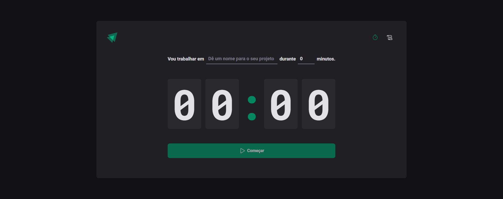
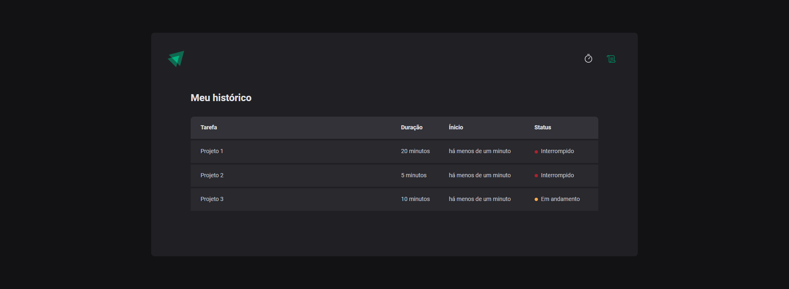

<h1 align="center">
    
</h1>

<span align="center">
    
</span>

Esse projeto é uma aplicação de pomodoro que consiste em um timer onde é possível adicionar as suas tarefas do dia a dia e cronometrá-las em um intervalo definido, com mínimo de 5 minutos e máximo de 60 minutos, possibilitando interromper o cronômetro e ver o histórico de tarefas realizadas (concluídas ou interrompidas).

## 🛠️ Construído com

Esse projeto foi desenvolvido com as seguintes tecnologias:

- [Vite](https://vitejs.dev)
- [ReactJS](https://reactjs.org)
- [TypeScript](https://www.typescriptlang.org/)
- [Styled Components](https://styled-components.com)

### 📋 Pré-requisitos

Para clonar e rodar essa aplicação, será necessário o [Git](https://git-scm.com) e o [Node.js](https://nodejs.org/en/) instalados no seu computador.

### 🔧 Como usar

```bash
# Clone este repositório
$ git clone https://github.com/guispati/Ignite-Timer.git

# Abra a pasta criada
$ cd Ignite-Timer

# Instale as dependências
$ npm install

# Inicie o projeto
$ npm run dev
```

## 💻 Demonstração

Na tela inicial você pode visualizar o cronômetro onde se baseia toda a aplicação, onde é possível criar uma nova tarefa definindo um tempo e descrição e ao clicar em começar o cronômetro começa a rodar, sendo possível interrompe-lo a qualquer momento:


Ao clicar no ícone do histórico, o usuário é redirecionado para outra rota onde é possível visualizar todas as tarefas realizadas naquela sessão (concluídas, em andamento ou interrompidas):


## 📄 Licença

Este projeto está sob a licença MIT - veja o arquivo [LICENSE.md](LICENSE.md) para mais detalhes.

---
⌨️ com ❤️ por [Guilherme Spati](https://github.com/guispati) 😊